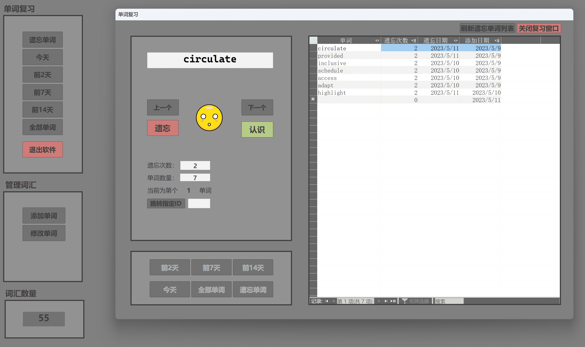

# 个人英语词汇数据库
使用Microsoft Access 编写的个人单词的数据库，内置查找遗忘单词功能

### 预览图

### 更新记录
#### 测试版V2.2 (2023-05-12）
#####新增功能
1. 点击认识刷新列表
2. 上一个和下一个按钮添加不可用提示
3. 添加单词时 可用回车输入
4. 添加单词成功反馈提示
5. 随机显示，不重复
6. 增加显示本周，上周的单词
#####优化体验
1. 修改一些错误bug
